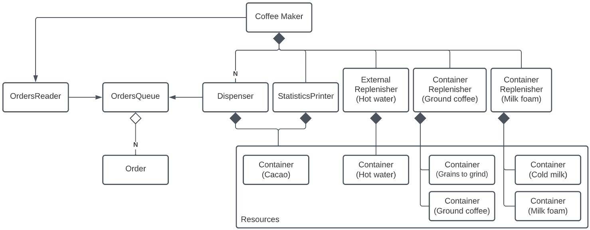

# TP1 - CoffeeGPT

El presente trabajo practico tiene como objetivo implementar una aplicacion en Rust que modele el control y reporte de una cafetera inteligente. Para esto sera necesario utilizar y aprender las herramientas de concurrencia vistas hasta el momento.

## Integrante

| Nombre                                                        | Padrón |
| ------------------------------------------------------------- | ------ |
| [Grassano, Bruno](https://github.com/brunograssano)           | 103855 |

## Ejecución

La aplicacion puede ser ejecutada a traves de `cargo` con:

```
$ cargo run
```

Adicionalmente se agregan las siguientes opciones en la ejecucion:
* Se puede indicar un archivo de ordenes distinto al por defecto (`orders.json`)
* Se puede cambiar el nivel de log con la variable de entorno `RUST_LOG`. Algunos valores posibles son `error`, `info`, y `debug`

De forma completa quedaria:
```
$ RUST_LOG=info cargo run my-orders.json
```

### Tests

Se proveen distintos casos de prueba de la aplicacion. Se pueden ejecutar con:
```
$ cargo test
```

Algunas pruebas destacadas son:
* Se prueba con un archivo que no existe
* Se prueba con un archivo vacio
* Se prueba con un formato equivocado
* Se prueba con ordenes en cantidad
* Se prueba que recargue los contenedores
* Se prueba que saltee ordenes en caso de agotarse los recursos

*Nota: Algunas pruebas se hacen considerando que los valores iniciales de los recursos son de 5000.*

## Diseño e implementación

### Formato del archivo
Para la lectura de ordenes de un archivo se utiliza el crate `serde` para leer y procesar archivos con formato JSON.

Este archivo tiene que seguir el siguiente formato:
```json
{
    "orders": [
        {
            "ground_coffee": 100,
            "hot_water": 150,
            "cacao": 60,
            "milk_foam": 70
        }
        ...
    ]
}
```

Las ordenes pueden estar conformadas por cafe (`ground_coffee`), agua caliente (`hot_water`), cacao (`cacao`) y espuma de leche (`milk_foam`). Cada una de estas cantidades tiene que ser un entero positivo o cero.

En caso de no respetarse el formato (por ejemplo, numeros negativos o tipos erroneos) se imprimira por pantalla el error y finalizara la ejecucion.

### Threads y comunicación

El modelo de la aplicacion se puede representar a traves del siguiente diagrama:




### Documentación
La documentacion de la aplicacion se puede ver con:
```
$ cargo doc --open
```
