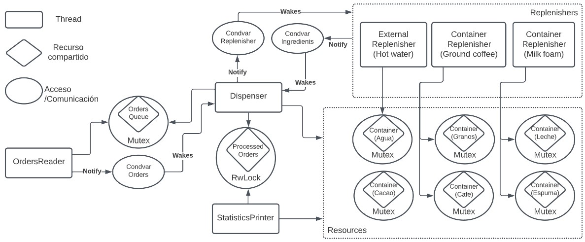

# TP1 - CoffeeGPT

El presente trabajo práctico tiene como objetivo implementar una aplicación en Rust que modele el control y reporte de una cafetera inteligente. Para esto será necesario utilizar y aprender las herramientas de concurrencia vistas hasta el momento.

## Integrante

| Nombre                                                        | Padrón |
| ------------------------------------------------------------- | ------ |
| [Grassano, Bruno](https://github.com/brunograssano)           | 103855 |

## Ejecución

La aplicación puede ser ejecutada a través de `cargo` con:

```
$ cargo run
```

Adicionalmente, se agregan las siguientes opciones en la ejecución:
* Se puede indicar un archivo de pedidos distinto al por defecto (`orders.json`)
* Se puede cambiar el nivel de log con la variable de entorno `RUST_LOG`. Algunos valores posibles son `error`, `info`, y `debug`

De forma completa quedaría:
```
$ RUST_LOG=info cargo run my-orders.json
```

### Tests

Se proveen distintos casos de prueba de la aplicación. Se pueden ejecutar con:
```
$ cargo test
```

Algunas pruebas destacadas son:
* Se prueba con un archivo que no existe
* Se prueba con un archivo vacío
* Se prueba con un formato equivocado
* Se prueba con pedidos en cantidad
* Se prueba que recargue los contenedores
* Se prueba que saltee pedidos en caso de agotarse los recursos
* Se prueba que se agoten todos los contenedores (los posibles)

Los archivos usados en estos tests se pueden ver en la carpeta `tests`.

* *Nota: Algunas pruebas se hacen considerando que los valores iniciales de los recursos son de 5000.*
* *Nota 2: Durante los tests el sleep es remplazado por yield.*

### Dependencias

La aplicación tiene las siguientes dependencias:
* `serde` y `serde_json` para poder leer y parsear los archivos JSON
* `rand` para generar numeros pseudoaleatorios, es usado al desordenar los ingredientes *(ver implementación)*
* `log` provee una unica interfaz para los logs *(error!(), info!(), debug!())*
* `simple_logger` la implementación de `log` para imprimir los mensajes.

## Diseño e implementación

### Formato del archivo
Para la lectura de pedidos de un archivo se utiliza el crate `serde` para leer y procesar archivos con formato JSON.

Este archivo tiene que seguir el siguiente formato:
```json
{

    "orders": [
        {

            "ground_coffee": 100,
            "hot_water": 150,
            "cacao": 60,
            "milk_foam": 70
        }
        // más ordenes...
    ]
}
```

Los pedidos pueden estar conformados por café (`ground_coffee`), agua caliente (`hot_water`), cacao (`cacao`) y espuma de leche (`milk_foam`). Cada una de estas cantidades tiene que ser un entero positivo o cero.

En caso de no respetarse el formato (por ejemplo, números negativos o tipos erróneos) se imprimirá por pantalla un mensaje de error y finalizará la ejecución.

### Modelo

El modelo de la aplicación se puede representar a través del siguiente diagrama.


Se puede ver como es la estructura en forma de objetos y como son las relaciones. Tenemos las siguientes características:
* `CoffeeMaker` inicia la cafetera, indica a los threads que deben de terminar, y los espera. Es el punto de entrada al sistema. 
* `Order` representa a un pedido de la cafetera. Está compuesto por los ingredientes y cantidades que necesita. 
    * Se tomó el supuesto de que un pedido no puede necesitar más recurso que lo definido en `MAX_OF_INGREDIENT_IN_AN_ORDER`. Al no alcanzar el recurso almacenado para cubrir una orden con el máximo establecido se recargará el contenedor si corresponde. Se toma este supuesto para simplificar el proceso de despertar los reponedores de recursos en vez de estar llevando a cero el recurso del contenedor y luego reponer.
    En caso de que un pedido tenga más que la constante se descarta ese ingrediente para el pedido.
    * Se realizó una optimización en las pedidos al hacer que los ingredientes sean recibidos en un vector que no sigue un orden en particular. De esta forma se busca mejorar la performance al momento de armar la orden en el dispenser. Esto se puede ver en `get_ingredients_from_order(...)` de `orders_reader.rs`.
* `OrderReader` es el encargado de realizar la lectura de los pedidos del archivo JSON. Este lee el archivo, realiza el parseo, y luego comienza a enviar los pedidos a través de `OrdersQueue`. Por cada orden despierta a los dispensers en caso de que estén esperando para realizar una orden. Al ir cargando de a uno este pedido se va simulando el arribo de los clientes con los pedidos. *Nota: No está implementado con un struct, es una función que cumple el rol.*
* `Container`, representa a un contenedor de la cafetera. Lleva el registro de cuanto queda de recurso y cuanto se fue consumiendo.
* `Resources` viene a agrupar a los distintos recursos que tiene la cafetera. Está implementado con un mapa donde la clave es el nombre del recurso y el valor el contenedor. Se decidió usar esta estructura de datos para reducir la cantidad de `ifs` que habría al ir procesando los pedidos en un dispenser.
* `Dispenser` es un dispensador de la cafetera. Estos obtienen los pedidos de la `OrdersQueue` y las procesan en el orden que venga el vector de ingredientes (en este punto se ven las optimizaciones mencionadas previamente).
    * En caso de que no alcance el recurso actual para cumplir lo requerido, despertara a los reponedores que se encargaran del proceso. Se optó por despertar a todos los reponedores para no estar complicando el código con chequeos y variables condicionales adicionales.
    * Si pasado el proceso de despertar a los reponedores sigue sin alcanzar el recurso (porque se acabo o no quedaba suficiente), se descarta la orden y se pierden los recursos utilizados hasta el momento. Se considera como si ya se hubieran tirado al vaso de la cafetera.
* `StatisticsPrinter`, es la estructura que va imprimiendo las estadísticas de uso y alarmas de bajo nivel de recurso.
    * El tiempo de espera se define en la constante `STATISTICS_WAIT_IN_MS`. Notar que la impresión de la estadística puede llevar más tiempo, ya que se está intentando acceder a distintos locks que pueden estar en uso por las otras entidades.
    * El nivel de alerta está definido en `X_PERCENTAGE_OF_CAPACITY`. Cuando los contenedores de granos, leche y cacao se encuentran por debajo de ese porcentaje de capacidad, se imprime por pantalla un mensaje de aviso del contenedor. El valor tiene que estar entre 0 y 100. 
* `ExternalReplenisher` y `ContainerReplenisher` son los reponedores de recursos. Se despiertan cuando el nivel del recurso que manejan es inferior a `MAX_OF_INGREDIENT_IN_AN_ORDER`. Al hacerlo toman el control de los contenedores que manejan y los recargan.
    *  `ExternalReplenisher` simula la recarga del mismo contenedor desde una fuente externa. En este caso es solamente el contenedor de agua que estaría tomando el agua de la red.
    * `ContainerReplenisher` simula el proceso de tomar recursos de un contenedor, convertirlos y cargar el contenedor deseado. Serían los recursos de café y leche.
    * El tiempo de espera que se tiene es `MINIMUM_WAIT_TIME_REPLENISHER` más la cantidad que se está reponiendo de recurso. 

### Threads y comunicación

En el siguiente diagrama se busca representar la forma de comunicación y threads que maneja la aplicación.


A partir del diagrama podemos notar:
* Se utilizaron locks para proteger los diferentes recursos compartidos.
* Hay 3 variables condicionales que se utilizan para que los hilos esperen y puedan despertarse cuando es necesario.
    * En un primer momento se utilizó un semáforo en remplazo a la variable condicional Orders. Este semáforo buscaba coordinar el acceso a la cola. Se terminó cambiando debido a que surgieron complicaciones al momento de querer finalizar el programa de forma ordenada.
* No se incluyo en el diagrama la comunicación con el hilo principal (main) para dar más claridad al diagrama. El hilo principal lo que hace es iniciar y esperar a que terminen los hilos.
    * En el caso de los hilos de estadísticas y reponedores, el hilo principal antes de esperarlos (join) realiza un cambio en sus estados para indicar que ya pueden finalizar. En los reponedores este cambio es notificado a través de su variable condicional, ya que pueden estar durmiendo cuando es realizado el cambio.
* La aplicación inicializa un total de N + 5 hilos adicionales durante toda su ejecución. Se armó un diseño donde la cantidad de hilos sea conocida para reducir el tiempo y costo de estar creando threads.
    * N dispensadores, estos trabajan solamente si tienen pedidos. N se define en la constante `N_DISPENSERS`
    * 3 hilos para reponedores (agua, leche, cafe), trabajan a pedido de un dispenser si se cumple su condición.
    * Hilo de estadísticas, imprime periódicamente por pantalla.
    * Lector de archivo, funciona hasta que se cargan todos los pedidos.

## Dificultades encontradas
Durante el transcurso del trabajo práctico se presentaron las siguientes dificultades:
* Surgieron problemas al momento de querer finalizar de forma prolija la aplicación. Esto se debía a que terminaba quedando algún hilo sin enterarse de que podía finalizar. El problema estaba sucediendo debido a como se estaba notificando y manejando el estado final (el flag estaba separado). Para su solución se recurrió a crear nuevas estructuras que agrupen estados usados por las variables condicionales, por ejemplo `OrdersQueue` y `Container`.
* Se tuvo una complicación al querer crear una interfaz común de los reponedores mediante Traits debido a que el compilador advertía que podía surgir un problema al momento de querer compartir entre hilos variables de las cuales se tiene que solo implementan el Trait. Esta complicación probablemente se debe a falta de experiencia con el lenguaje.
* Se nota la complejidad de realizar pruebas unitarias en ambientes concurrentes.


## Documentación
La documentación de la aplicación se puede ver con:
```
$ cargo doc --open
```
